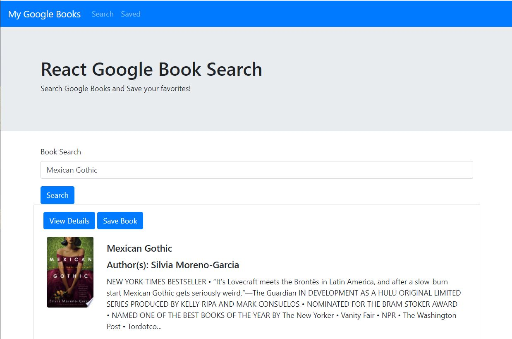
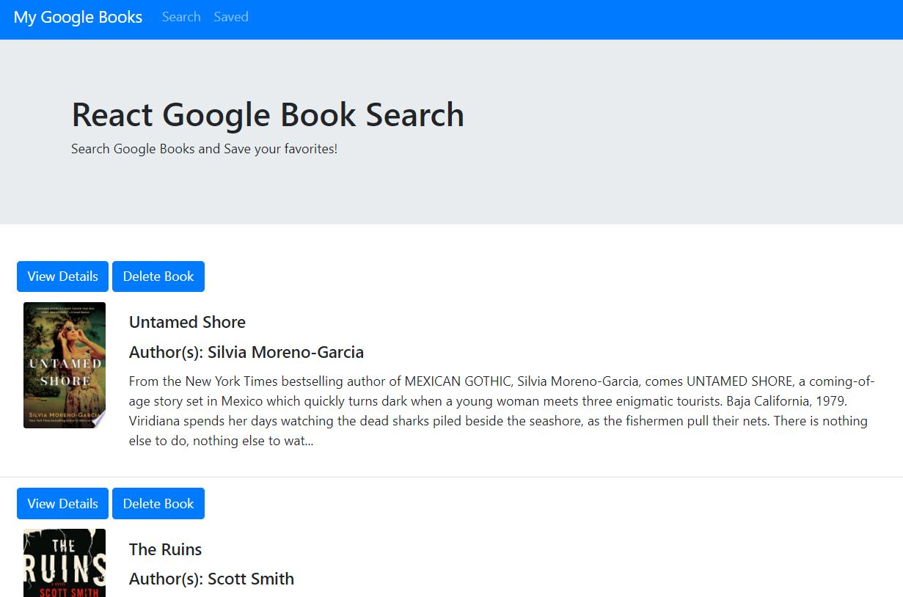

# Google Books Search and Save


## Table of Contents
* [Description](#description)
* [Links](#links)
* [User Story](#User_Story)
* [Acceptance Criteria](#Acceptance_Criteria)
* [Dependencies](#Dependencies)
* [Usage](#usage)
* [License](#license)

## Description
This application is a React-based Google Books search that allows users to save their favorite books. The app utilizes Node, Express, and MongoDB and a 3P API Google Books.

## Links
* Live Website: https://seattlesal-google-books.herokuapp.com/
* Github Link: https://github.com/SeattleSal/google-books-react

## User_Story
AS a user
I WANT to search for books and save my favorites 
SO THAT I have quick access to my favorite books

## Acceptance_Criteria
The user should be able to:

  * User can search for books via the Google Books API and render them here. User has the option to "View" a book, bringing them to the book on Google Books, or "Save" a book, saving it to the Mongo database.

  * Renders all books saved to the Mongo database. User has an option to "View" the book, bringing them to the book on Google Books, or "Delete" a book, removing it from the Mongo database.

## Dependencies
This project was created with starter code [Create React App](https://github.com/facebook/create-react-app).

Additional dependencies are:
* [axios](https://www.npmjs.com/package/axios) for making API calls
* [bootstrap](https://www.npmjs.com/package/bootstrap) for styling elements
* [react-bootstrap](https://react-bootstrap.github.io/) for styling the drop down. 
* [mongoose](https://www.npmjs.com/package/mongoose) for the database storing the user's favorite books.

There is a `package.json` included, the following commands should be run to install dependencies:

```bash
npm i
```

## Usage
Use the links above to use the application live on Heroku. If you prefer to run the application from your computer, you can use the following command after installing the dependencies:

```bash
npm start
```

The application displays two pages - Search and Saved. The Search page has a search input that calls the Google Books API and returns book information. The user can click a button to get more info about the book or save the books to their favorites. The Saved page shows info on each saved book and allows the user to press a button to get more info or delete the book from their saved books. 

See Screenshots:<br>
Search Page: <br>

<br>
Saved Page: <br>


## License

MIT License

Copyright (c) [2021] [Sally Perez]

Permission is hereby granted, free of charge, to any person obtaining a copy
of this software and associated documentation files (the "Software"), to deal
in the Software without restriction, including without limitation the rights
to use, copy, modify, merge, publish, distribute, sublicense, and/or sell
copies of the Software, and to permit persons to whom the Software is
furnished to do so, subject to the following conditions:

The above copyright notice and this permission notice shall be included in all
copies or substantial portions of the Software.

THE SOFTWARE IS PROVIDED "AS IS", WITHOUT WARRANTY OF ANY KIND, EXPRESS OR
IMPLIED, INCLUDING BUT NOT LIMITED TO THE WARRANTIES OF MERCHANTABILITY,
FITNESS FOR A PARTICULAR PURPOSE AND NONINFRINGEMENT. IN NO EVENT SHALL THE
AUTHORS OR COPYRIGHT HOLDERS BE LIABLE FOR ANY CLAIM, DAMAGES OR OTHER
LIABILITY, WHETHER IN AN ACTION OF CONTRACT, TORT OR OTHERWISE, ARISING FROM,
OUT OF OR IN CONNECTION WITH THE SOFTWARE OR THE USE OR OTHER DEALINGS IN THE
SOFTWARE.

